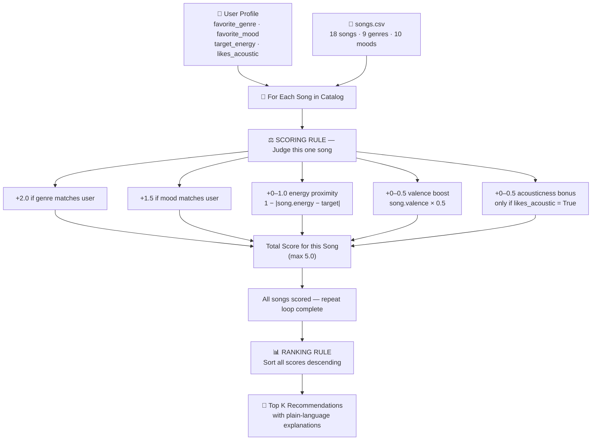

# 🎵 Music Recommender Simulation

## Project Summary

In this project you will build and explain a small music recommender system.

Your goal is to:

- Represent songs and a user "taste profile" as data
- Design a scoring rule that turns that data into recommendations
- Evaluate what your system gets right and wrong
- Reflect on how this mirrors real world AI recommenders

This simulation builds a **content-based music recommender** that scores songs purely from their audio attributes and compares them to a user's stated taste profile. There is no dependency on other users' listening history — every recommendation is derived from the song's own features (genre, mood, energy, valence, acousticness) matched against what the user tells us they enjoy.

---

## How The System Works

### How real-world systems work

Streaming platforms like Spotify and YouTube Music use two complementary approaches to decide what to play next:

**Collaborative filtering** looks at the collective behavior of millions of users. If users who listened to Song A also consistently played Song B, the system infers Song B is likely a good next recommendation for anyone who liked Song A — even if the two songs share no obvious audio properties. The signal here is *other people's taste*, not the song's own attributes.

**Content-based filtering** ignores other users entirely. It studies the song's own measurable properties — tempo, energy, genre, mood, acousticness — and compares them to the current listener's preference profile. If you like high-energy pop songs, it finds other high-energy pop songs. The signal here is *feature similarity*.

Real platforms combine both (called a hybrid approach), layering in signals like recency, skips, playlist adds, and even the time of day. The main data types involved are:
- **Behavioral data**: likes, skips, playlist adds, repeat plays, session context
- **Audio features**: tempo, energy, valence, danceability, mood, genre, acousticness

### What this simulation prioritizes

This version is a pure **content-based** recommender. It uses only song attributes and a declared user profile — no listening history, no other users.

**`Song` object features:**
| Feature | Type | Role |
|---|---|---|
| `genre` | categorical | Broadest filter; worth the most points (2.0) |
| `mood` | categorical | Emotional tone match (1.5 points) |
| `energy` | float 0–1 | Proximity score — rewards closeness to user's target |
| `valence` | float 0–1 | Positivity/happiness of the track (small lift) |
| `acousticness` | float 0–1 | Bonus if user prefers acoustic feel |
| `tempo_bpm` | float | Available in data; not yet weighted (future experiment) |
| `danceability` | float 0–1 | Available in data; not yet weighted (future experiment) |

**`UserProfile` object stores:**
- `favorite_genre` — the genre the user wants more of
- `favorite_mood` — the emotional tone they're after
- `target_energy` — a 0–1 float representing their desired intensity level
- `likes_acoustic` — boolean flag that enables the acousticness bonus

### The Algorithm Recipe

**Finalized Scoring Rule** (answers: "How good is this ONE song for this user?")

| Signal | Points | Why this weight |
|---|---|---|
| Genre exact match | **+2.0** | Genre is the broadest musical family — the single strongest filter |
| Mood exact match | **+1.5** | Mood captures emotional intent; second most important signal |
| Energy proximity | **+0.0 to +1.0** | `1 − |song.energy − target_energy|` — rewards closeness, not just high/low |
| Valence boost | **+0.0 to +0.5** | `song.valence × 0.5` — small lift for positive/upbeat tracks |
| Acousticness bonus | **+0.0 to +0.5** | `song.acousticness × 0.5`, only applied when `user.likes_acoustic = True` |
| **Maximum possible** | **5.0** | |

```
score = 0
if song.genre == user.favorite_genre  →  +2.0
if song.mood  == user.favorite_mood   →  +1.5
energy_proximity = 1 - |song.energy - user.target_energy|
score += energy_proximity × 1.0      →  up to +1.0
score += song.valence × 0.5          →  up to +0.5
if user.likes_acoustic:
    score += song.acousticness × 0.5 →  up to +0.5
```

We need **both** a Scoring Rule and a Ranking Rule because they do different jobs:
- The **Scoring Rule** answers "how relevant is this one song?" — it produces a single number per song.
- The **Ranking Rule** answers "given all those numbers, which songs bubble to the top?" — it sorts the scored list descending and takes the top _k_.

Without the Scoring Rule you have nothing to sort. Without the Ranking Rule you have a pile of numbers with no output.

### Data Flow Diagram



### User Profile Design

The simulation's example profile:

```python
user_prefs = {
    "genre":  "pop",   # favorite_genre
    "mood":   "happy", # favorite_mood
    "energy": 0.8,     # target_energy (0.0 = silent, 1.0 = maximum intensity)
}
```

**Can this profile tell apart "intense rock" from "chill lofi"?**  
Yes — and here is why each song type scores differently:

| Song type | Genre pts | Mood pts | Energy pts (approx) | Total |
|---|---|---|---|---|
| Pop / happy / energy 0.82 | +2.0 | +1.5 | +0.98 | ~4.5 |
| Rock / intense / energy 0.91 | +0.0 | +0.0 | +0.89 | ~0.9 |
| Lofi / chill / energy 0.40 | +0.0 | +0.0 | +0.60 | ~0.6 |

The genre and mood binary checks create a sharp cliff between matching and non-matching categories, so intense rock and chill lofi land in very different score ranges. The profile is **not too narrow** for this catalog — it produces clear differentiation.

**Known limitation of this profile shape:** two songs with the same genre and mood but wildly different tempos (e.g., 80 BPM vs 160 BPM) receive the same categorical bonus. Tempo is available in the CSV but not yet weighted; adding a `target_tempo` field to the profile would close this gap.

### Expected Biases

- **Genre over-dominance**: +2.0 for genre vs +1.5 for mood means a wrong-mood song in the right genre will almost always beat a right-mood song in the wrong genre. A jazz/chill song could outrank a pop/happy song for a pop-happy user if the jazz track is slightly closer in energy.
- **Energy proximity is symmetric**: a song 0.15 below target scores the same as one 0.15 above — the system does not distinguish between "a bit too quiet" and "a bit too loud."
- **Catalog size bias**: with only 18 songs, if a user prefers a rare genre (like classical or reggae, each represented once), the top slots will be filled by songs from other genres with high energy proximity scores.
- **Valence skew**: the valence bonus always favors happy-sounding songs, regardless of whether the user wants that — a moody or melancholic user profile has no way to express a preference for *lower* valence.

---

## Getting Started

### Setup

1. Create a virtual environment (optional but recommended):

   ```bash
   python -m venv .venv
   source .venv/bin/activate      # Mac or Linux
   .venv\Scripts\activate         # Windows

2. Install dependencies

```bash
pip install -r requirements.txt
```

3. Run the app:

```bash
python -m src.main
```

### Running Tests

Run the starter tests with:

```bash
pytest
```

You can add more tests in `tests/test_recommender.py`.

---

## CLI Output

Running `python -m src.main` with the default pop/happy/0.8 profile produces:

```
Loading songs from data/songs.csv...
Loaded songs: 18

==================================================
  User profile
  Genre : pop
  Mood  : happy
  Energy: 0.8
==================================================

Top recommendations:

  1. Sunrise City  —  Neon Echo
     Genre: pop  |  Mood: happy  |  Energy: 0.82
     Score : 4.90
     Reasons: genre match (+2.0), mood match (+1.5), energy proximity (+0.98), valence boost (+0.42)

  2. Gym Hero  —  Max Pulse
     Genre: pop  |  Mood: intense  |  Energy: 0.93
     Score : 3.26
     Reasons: genre match (+2.0), energy proximity (+0.87), valence boost (+0.39)

  3. Rooftop Lights  —  Indigo Parade
     Genre: indie pop  |  Mood: happy  |  Energy: 0.76
     Score : 2.87
     Reasons: mood match (+1.5), energy proximity (+0.96), valence boost (+0.41)

  4. Concrete Jungle  —  Phantom Bloc
     Genre: hip-hop  |  Mood: energetic  |  Energy: 0.85
     Score : 1.27
     Reasons: energy proximity (+0.95), valence boost (+0.32)

  5. Night Drive Loop  —  Neon Echo
     Genre: synthwave  |  Mood: moody  |  Energy: 0.75
     Score : 1.19
     Reasons: energy proximity (+0.95), valence boost (+0.24)
```

Results match expectations: the exact genre+mood+energy match (Sunrise City) scores nearly 5.0, while the second pop track (Gym Hero) drops to 3.26 because mood is wrong. Songs 4–5 score low because they share no categorical features with the profile, relying only on energy/valence similarity.

---

## Experiments You Tried

Use this section to document the experiments you ran. For example:

- What happened when you changed the weight on genre from 2.0 to 0.5
- What happened when you added tempo or valence to the score
- How did your system behave for different types of users

---

## Limitations and Risks

Summarize some limitations of your recommender.

Examples:

- It only works on a tiny catalog
- It does not understand lyrics or language
- It might over favor one genre or mood

You will go deeper on this in your model card.

---

## Reflection

Read and complete `model_card.md`:

[**Model Card**](model_card.md)

Write 1 to 2 paragraphs here about what you learned:

- about how recommenders turn data into predictions
- about where bias or unfairness could show up in systems like this


---

## 7. `model_card_template.md`

Combines reflection and model card framing from the Module 3 guidance. :contentReference[oaicite:2]{index=2}  

```markdown
# 🎧 Model Card - Music Recommender Simulation

## 1. Model Name

Give your recommender a name, for example:

> VibeFinder 1.0

---

## 2. Intended Use

- What is this system trying to do
- Who is it for

Example:

> This model suggests 3 to 5 songs from a small catalog based on a user's preferred genre, mood, and energy level. It is for classroom exploration only, not for real users.

---

## 3. How It Works (Short Explanation)

Describe your scoring logic in plain language.

- What features of each song does it consider
- What information about the user does it use
- How does it turn those into a number

Try to avoid code in this section, treat it like an explanation to a non programmer.

---

## 4. Data

Describe your dataset.

- How many songs are in `data/songs.csv`
- Did you add or remove any songs
- What kinds of genres or moods are represented
- Whose taste does this data mostly reflect

---

## 5. Strengths

Where does your recommender work well

You can think about:
- Situations where the top results "felt right"
- Particular user profiles it served well
- Simplicity or transparency benefits

---

## 6. Limitations and Bias

Where does your recommender struggle

Some prompts:
- Does it ignore some genres or moods
- Does it treat all users as if they have the same taste shape
- Is it biased toward high energy or one genre by default
- How could this be unfair if used in a real product

---

## 7. Evaluation

How did you check your system

Examples:
- You tried multiple user profiles and wrote down whether the results matched your expectations
- You compared your simulation to what a real app like Spotify or YouTube tends to recommend
- You wrote tests for your scoring logic

You do not need a numeric metric, but if you used one, explain what it measures.

---

## 8. Future Work

If you had more time, how would you improve this recommender

Examples:

- Add support for multiple users and "group vibe" recommendations
- Balance diversity of songs instead of always picking the closest match
- Use more features, like tempo ranges or lyric themes

---

## 9. Personal Reflection

A few sentences about what you learned:

- What surprised you about how your system behaved
- How did building this change how you think about real music recommenders
- Where do you think human judgment still matters, even if the model seems "smart"

