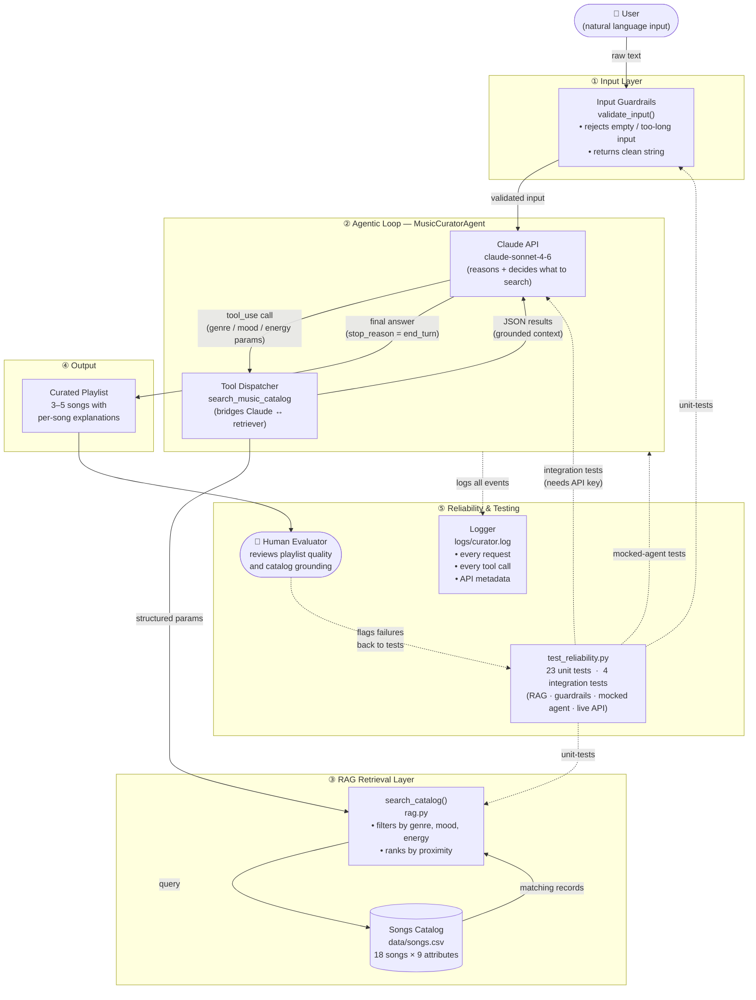

# System Architecture Diagram

Paste the code block below into https://mermaid.live to export as PNG.

```mermaid
flowchart TD
    User(["👤 User\n(natural language input)"])

    subgraph GUARD ["① Input Layer"]
        Guardrails["Input Guardrails\nvalidate_input()\n• rejects empty / too-long input\n• returns clean string"]
    end

    subgraph AGENT ["② Agentic Loop  —  MusicCuratorAgent"]
        direction TB
        Claude["Claude API\nclaude-sonnet-4-6\n(reasons + decides what to search)"]
        ToolDispatch["Tool Dispatcher\nsearch_music_catalog\n(bridges Claude ↔ retriever)"]
        Claude -->|"tool_use call\n(genre / mood / energy params)"| ToolDispatch
        ToolDispatch -->|"JSON results\n(grounded context)"| Claude
    end

    subgraph RAG ["③ RAG Retrieval Layer"]
        Retriever["search_catalog()\nrag.py\n• filters by genre, mood, energy\n• ranks by proximity"]
        Catalog[("Songs Catalog\ndata/songs.csv\n18 songs × 9 attributes")]
        Retriever -->|"query"| Catalog
        Catalog -->|"matching records"| Retriever
    end

    subgraph OUTPUT ["④ Output"]
        Playlist["Curated Playlist\n3–5 songs with\nper-song explanations"]
    end

    subgraph RELIABILITY ["⑤ Reliability & Testing"]
        direction LR
        Logger["Logger\nlogs/curator.log\n• every request\n• every tool call\n• API metadata"]
        Tests["test_reliability.py\n23 unit tests  ·  4 integration tests\n(RAG · guardrails · mocked agent · live API)"]
        HumanEval(["👤 Human Evaluator\nreviews playlist quality\nand catalog grounding"])
    end

    %% Main data flow
    User -->|"raw text"| Guardrails
    Guardrails -->|"validated input"| Claude
    ToolDispatch -->|"structured params"| Retriever
    Claude -->|"final answer\n(stop_reason = end_turn)"| Playlist
    Playlist --> HumanEval

    %% Logging (side channel)
    AGENT -. "logs all events" .-> Logger

    %% Testing hooks
    Tests -. "unit-tests" .-> Guardrails
    Tests -. "unit-tests" .-> Retriever
    Tests -. "mocked-agent tests" .-> AGENT
    Tests -. "integration tests\n(needs API key)" .-> Claude
    HumanEval -. "flags failures\nback to tests" .-> Tests
```
